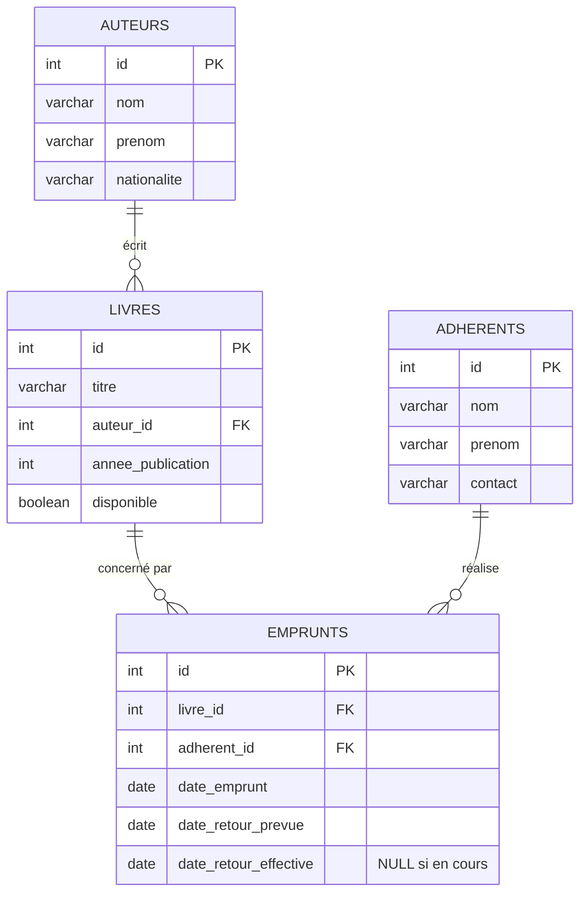

# Diagramme entité-relation — Bibliothèque de quartier

## Relations

- **Auteur → Livres** : un-à-plusieurs. Un auteur peut avoir écrit plusieurs livres ; un livre a un seul auteur.
- **Livre → Emprunts** : un-à-plusieurs. Un livre peut faire l'objet de plusieurs emprunts successifs dans le temps (mais un seul emprunt actif à la fois, contrôlé par le champ `disponible`).
- **Adhérent → Emprunts** : un-à-plusieurs. Un adhérent peut avoir plusieurs emprunts (en cours et passés).

## Choix de modélisation

- `emprunts.date_retour_effective` est **nullable** : `NULL` signifie que l'emprunt est toujours en cours. C'est ce champ qui permet de distinguer un emprunt actif d'un emprunt terminé, et de calculer les retards (`date_retour_prevue < CURRENT_DATE AND date_retour_effective IS NULL`).
- `livres.disponible` est un booléen dénormalisé, mis à jour par transaction lors de la création/du retour d'un emprunt, pour éviter de recalculer la disponibilité à chaque lecture.
- Les clés étrangères (`livres.auteur_id`, `emprunts.livre_id`, `emprunts.adherent_id`) sont en **`RESTRICT`** (comportement par défaut de PostgreSQL) et non en `CASCADE` : on ne peut pas supprimer un auteur, un livre ou un adhérent tant qu'il existe des enregistrements liés, afin de préserver l'historique des emprunts.
